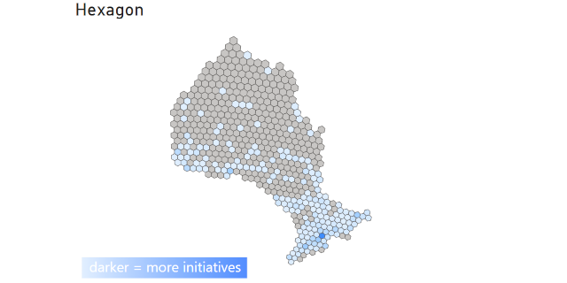

# Hexagon

This project demonstrates how to use the h3 library to create a hex map of any shape map, in this case Ontario.

## Getting the data

this file lists all data needed to run this project.

> NOTE: to avoid duplicating data, no original data is stored in this repo.

### HEXAGONTARIO

To create the hexagon map of ontario you will need `Project.geojson` file from [here](https://geohub.lio.gov.on.ca/datasets/lio::province/about) and move it into the a folder named `raw` without changing it's name.

### Assign Id's

To download the sample ID dataset, visit the [Ontario Builds: key infrastructure projects](https://data.ontario.ca/dataset/ontario-builds-key-infrastructure-projects/resource/36f92c5b-0c8b-4a4b-b4c5-d15a43894297) site and download the csv version, then move it into the `raw` folder without changing it's name.

## How to run

### (Optional) Create virtual machine

You can create a virtual machine to keep your python installation clean by running

`python -m venv [name of virutal machine]`

with `[name of virutal machine]` replaced with the actual name of the virutal machine, I usually use the name `venv`.

Activate the virtual machine using `venv\Scripts\Activate` on windows or `venv/bin/activate` on linux.

### Install dependencies

Run the command

`pip install -r requirements.txt`

To install the requirements for this program

### Create HEXAGONTARIO map

Run the command `python hexagontario.py` command to build the hexagontario map into the `output` file. The file will be named `province.[resolution].geojson` and can then be comverted into a topojson file using [Mapshapper](https://mapshaper.org/). The [resolution](https://h3geo.org/docs/core-library/restable/) can be modified by passing it in as a command line argument, for example `python hexagontarion.py 3` will output a file named `province.3.geojson`.

> Note, if the id generated will only map to tiles with the same resolution. For example if you add id's at a resolution of `4` you should generate a map with a resolution of `4` so the tiles are mapped properly.

### Assign ID's

While the primary product of this repo is the HEXAGONTARIO map, there is also sample code for assigning hex id's to an example dataset here as well.
